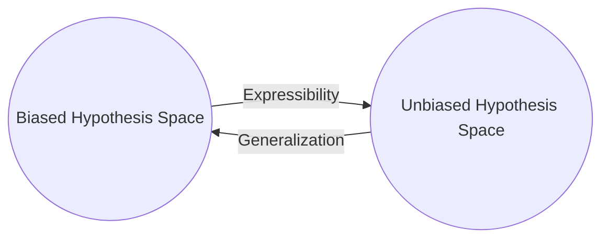

# SL1. Mitchell Basics

## Mitchell ch1. Introduction

### Designing a learning system

> [!NOTE] Definition (**Learning**): 
> A computer program is said to **learn** from **experience** $E$ with respect to some class of **tasks** $T$ and **performance measure** $P$, if its performance at tasks in T, as measured by P, improves with experience E.
> 
> Note: Can be reduced to searching the best hypothesis $h$ in the space of possible hypothesis $H$. 

1. Training experience
	1. Type of feedback
		- Direct. Easier. Every step to achieve the outcome must be correct.
		- Indirect. Harder. Correctness of each step must be inferred from the final outcome.
	2. Level of control of the learner
		- Heteronomy. Rely on a teacher that 1) provides the training examples; 2) provide the correct strategy.
		- Autonomy. Complete control on both.
		- Mixed. Can ask queries to the learner.
	3. Representability of the final system of performance
		- **Crucial assumption.** Training examples $\overset{d}{=}$ Test examples
2. Target function
	- In practice we reduced the problem of improving $P$ at $T$ with $E$ by learning a **target function** $V: \Omega \rightarrow E$.
	- $V$  usually is a **nonoperational definition**, hence we employ an **target function representation** $\widehat{V}$.
	- **Expressiveness** of $\widehat V(\cdot; \theta)$. The degree of closeness to $V$. 
		- Involves a tradeoff with the operability.
		- Provided the functional form the learning reduces to estimate the parameters $\theta$. 
3. Function approximation algorithm
	1. Estimate training values $V_{train}(\omega)$.
	2. Specify learning algorithm
		1. Avoid overfitting to generalize beyond training data
4. Final desing

| Part | Design choice                  |
| ---- | ------------------------------ |
|      | Task                           |
|      | Performance measure            |
|      | Training experience            |
|      | Target function                |
|      | Target function representation |
|      | Space of possible hyp          |
## Mitchell ch2
### Concept learning

> [!ABSTRACT] Concept Learning and the General-to-Specific Ordering
> The problem of inducing general functions from specific training examples is central to learning. This chapter considers **concept learning**: acquiring the definition of a general category given a sample of positive and negative training examples of the category. Concept learning can be formulated as a *problem of searching through a predefined space of potential hypotheses for the hypothesis that best fits the training examples*. In many cases this search can be efficiently organized by taking a*dvantage of a naturally occurring structure* over the hypothesis space-a generalto-specific ordering of hypotheses. This chapter presents several learning algorithms and considers situations under which they converge to the correct hypothesis. We also examine the nature of **inductive learning** and the justification by which any program may successfully **generalize** beyond the observed training data.

> [!NOTE] Definition (**Concept learning**): 
> Inferring a boolean-valued function from training examples of its input and output.
> 
> **Alternative definition**: Problem of automatically inferring the general definition of some concept, given examples labeled as members or nonmembers of the **target concept**. 

| Notation                       | Name             | Definition                                                                                                 |
| ------------------------------ | ---------------- | ---------------------------------------------------------------------------------------------------------- |
| $X$                            | Set of instances | The set of items over which the concept is defined.                                                        |
| $c:X \rightarrow \{0,1\}$      | Target concept   | The concept or function to be learned.                                                                     |
| $\langle x \in X, c(x)\rangle$ | Training example | Order paired of a instance of $X$ and its target concept $c$.                                              |
| $D$                            | Training data    | Set of available training examples.                                                                        |
| $h: X \rightarrow \{0,1\}$     | Hypothesis       | boolean-valued function defined over $X$.                                                                  |
| $H$                            | Hypothesis space | Set of all possible hypotheses that the learner may consider regarding the identity of the target concept. |
| $x^+$                          | Members          | or positive examples, are instances where $c(x) = 1$.                                                      |
| $x^-$                          | Non members      | or negative examples, are instances where $c(x) = 0$.                                                      |

> [!ERROR] Crucial assumptions
> **Inductive learning hypothesis.** Any hypothesis found to approximate the target function well over a sufficiently large set of training examples will also approximate the target function well over other unobserved examples.

- **Syntactically distinct.** If their expressions (their written forms, symbols, structure, rules, formulas) are different 
- **Semantically distinct.** If they represent different meanings.
	- E.g. Let $f(x) = x + x$ and $g(x) = 2x$. Then $f$ is semantically identical to $g$ but syntactically distinct.
- **Conjunctive hypothesis**. *And*
- **Disjunctive hypothesis**. Or
- **Negative hypothesis**. Not

> [!NOTE] Definition (more_general_than_or_equal_to relation)
> Let $h_j$ and $h_k$ be boolean-valued functions defined over $X$. Then 
> $$h_j \geq_g h_k \equiv (\forall x \in X)(h_k(x)=1 \rightarrow h_j(x)=1).$$
> 
> Its strictly version is defined as 
> $$h_j >_g h_k \equiv (h_j \geq_g h_k) \land (h_k \ngeq_g h_j).$$
> 
$\geq_g$ defines a **total order** over $H$ if
> 
> 1. **Reflexive**. $\forall h \in H$, $h \geq_g h$.
> 2. **Antisymmetric**. $(h_1 \geq_g h_2) \land (h_2 \geq_g h_1) \rightarrow h_1 = h_2$
> 3. **Transitive**. $(h_1 \geq_g h_2) \land (h_2 \geq_g h_3) \rightarrow h_1 \geq_g h_3$
> 4. **Totality.** For all $\forall h_1, h_2 \in H$, either $h_1 \geq_g h_2$ or $h_2 \geq_g h_1$​.
> 
> If 4 is not satisfy, defines a **partial order**.

### FIND-S and CANDIDATE-ELIMINATION algorithms

> [!NOTE] Definitions
> 1. $h$ is **consistent** in $D$ iff $\forall \langle x, c(x)\rangle \in D$, $h(x) = c(x)$.
> 
> 2. $h$ **satisfies** in $D$ iff $\forall \langle x, c(x)\rangle \in D$, if (c(x) = 1$ then $h(x) = c(x)$.
> 
> 3. The **version space**, denoted $VS_{H,D}$, with respect to $H$ and $D$, is the subset of hypotheses from $H$ **consistent** with the **training examples** in $D.$
> $$VS_{H,D} \equiv \{h \in H | Consistent(h,D)\}$$
> 
> 4. The **general boundary** $G$, with respect to $H$ and $D$, is the set of **maximally** general members of $H$ consistent with $D$.
>    $$G \equiv \{ g \in H | Consistent(g,D) \land (\lnot\exists h \in H)[Consistent(h,D) \land (h >_g g)\}$$
> 
> 5. The **specific boundary** $S$, with respect to $H$ and $D$, is the set of **minimally** general (i.e., maximally specific) members of $H$ consistent with $D$.
>    $$S \equiv \{ s \in H | Consistent(s,D) \land (\lnot\exists h \in H)[Consistent(h,D) \land (s >_g h)\}$$

> [!CHECK] Theorem 2.1. Version space representation theorem
> For all $X$, $H$, $c$, and $D$ such that $S$ and $G$ are well defined,
> $$VS_{H,D} = \{h \in H | (\exists s \in S)(\exists g \in G)(g \geq_g h \geq_g s)\}$$
> **Corolary**
> - $S$ is sufficient to determine wether the whole version space classify a hypothesis as **positive**.
> - $G$ ... negative.

Both assume that $c \in H$ and $x \in X$ is error-free.
1. FIND-S. The search moves from hypothesis to hypothesis, searching from the most specific to progressively more general hypotheses along one chain of the partial ordering.
	- Fast
	- Only check if satisfies (positive examples) but implies consistency.
	- Guarantee to output the most specific $h$ **consistent** (covers all training data).
		- Only provides one consistent hypothesis.
		- Dependent of the sequence in which the training examples are presented.
2. CANDIDATE-ELIMINATION
	- Return the **version space** 
		- Expensive.
	- Independent of the sequence in which the training examples are presented.
	- **Optimal query** strategy for a concept learner is to generate instances that satisfy exactly half the hypotheses in the current version space.
		- The correct target concept can therefore be found with only $\log_2|H|$ experiments.
			- $y = \log_p(x) \equiv p^y = x$ 
			- Se deriva de dividir |H| a la mitad hasta llegar al "peor" escenario, es decir, cuando |VS|=1.
			- No siempre es factible.
	- **Partially learned concept**. the version space has more than one hypothesis.
		- Degree of confidence by a weighted voting.
### Inductive bias

- The **unbiased learner** is unable to generalize beyond the observed examples.
	1. $H$ represents every teachable concept. Voting is futile 
		- Power set of instances $X$. $\mathcal{P}(X)$ set of all subsets of $X$, including the empty set and $X$ itself.
			- $|\mathcal{P}(S)| = 2^{|S|}$
	2. ROTE-LEARNER. Only classifies training examples.

> [!ERROR] Limitation of inductive inference
> A learner that makes no a priori assumptions regarding the identity of the target concept has no rational basis for classifying any unseen instances.
> - Requires to sacrifice the **expressibility** of $H$ or (inclusive) introduce a **inductive bias** (prior assumptions).
	
> [!NOTE] Inductive bias
> Consider a concept learning algorithm $L$ for the set of instances $X$. Let $f$ be an arbitrary concept defined over $X$, and let $D_c = \{\langle x, c(x)\rangle\}$ be an arbitrary set of training examples of $c$. Let $L(x_i, D_c)$ denote the classification assigned to the instance $x_i$ by $L$ after training on the data $D_c$. The **inductive bias** of $L$ is *any minimal set of assertions* $B$ such that for any target concept $c$ and corresponding training examples $D_c$
> $$(\forall x_i \in X)[(B \land D_c \land x_i) \vdash L(x_i, D_c)]$$
> 
> $y \succ z$ indicates that $z$ is **inductively inferred** from $y$.
> $y \vdash z$ indicates that $z$ is **deductively inferred** from $y$.

# SL2. Decision Trees
## Mitchell ch3

> [!ABSTRACT] Decision tree learning
> **Decision tree learning** is one of the most widely used and practical methods for **inductive inference**. It is a method for *approximating discrete-valued functions that is robust to noisy data and capable of learning disjunctive expressions*. This chapter describes a family of decision tree learning algorithms that includes widely used algorithms such as **ID3**, **ASSISTANT**, and **C4.5**. These decision tree learning methods search a *completely expressive hypothesis space* and thus avoid the difficulties of restricted hypothesis spaces. Their **inductive bias** "is" a preference for small trees over large trees.
