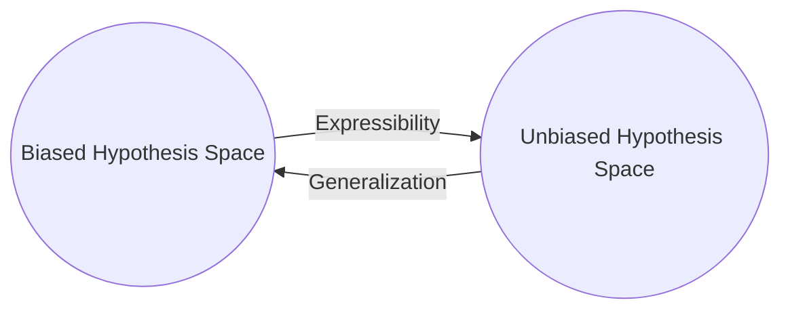
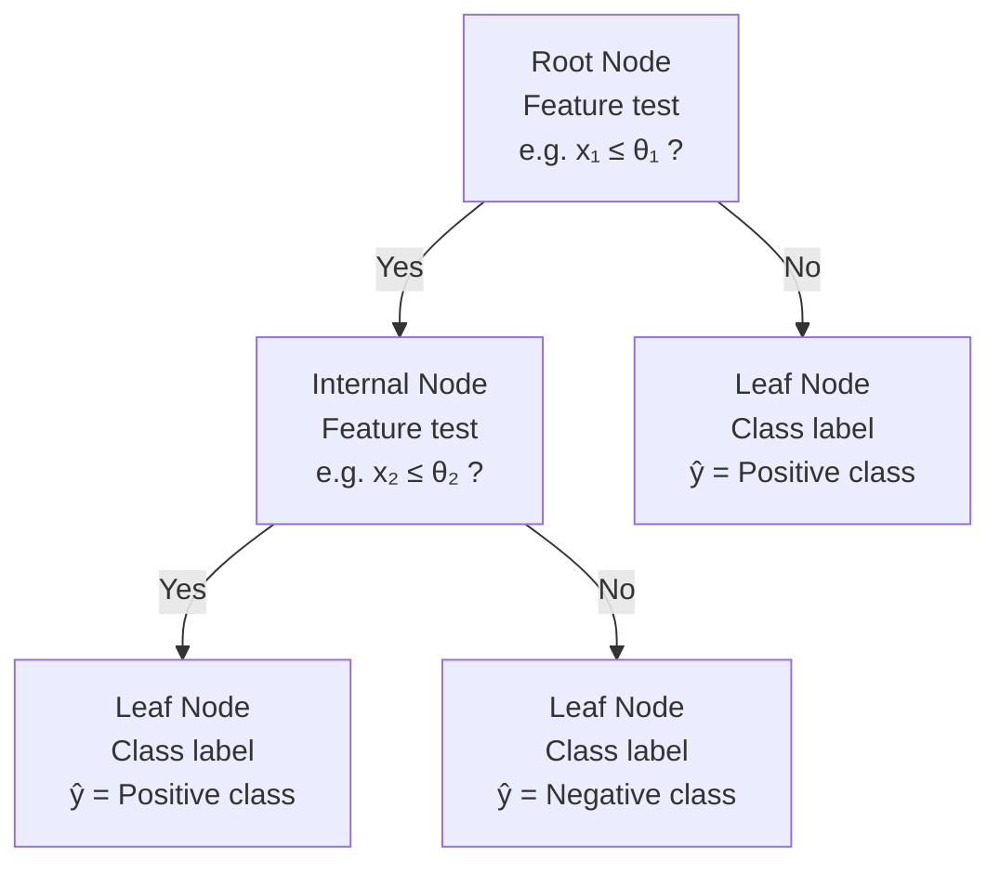
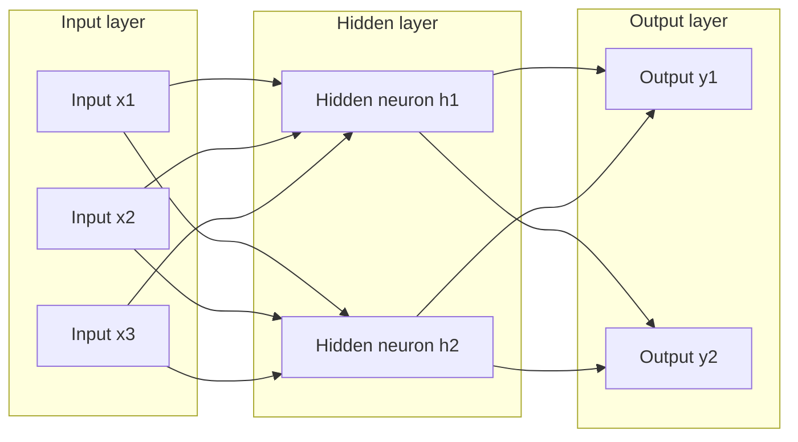

# SL1. Mitchell Basics

## Mitchell ch1. Introduction

### Designing a learning system

> [!NOTE] Definition (**Learning**): 
> A computer program is said to **learn** from **experience** $E$ with respect to some class of **tasks** $T$ and **performance measure** $P$, if its performance at tasks in T, as measured by P, improves with experience E.
> 
> Note: Can be reduced to searching the best hypothesis $h$ in the space of possible hypothesis $H$. 


1. Training experience
	1. Type of feedback
		- Direct. Easier. Every step to achieve the outcome must be correct.
		- Indirect. Harder. Correctness of each step must be inferred from the final outcome.
	2. Level of control of the learner
		- Heteronomy. Rely on a teacher that 1) provides the training examples; 2) provide the correct strategy.
		- Autonomy. Complete control on both.
		- Mixed. Can ask queries to the learner.
	3. Representability of the final system of performance
		- **Crucial assumption.** Training examples $\overset{d}{=}$ Test examples
2. Target function
	- In practice we reduced the problem of improving $P$ at $T$ with $E$ by learning a **target function** $V: \Omega \rightarrow E$.
	- $V$  usually is a **nonoperational definition**, hence we employ an **target function representation** $\widehat{V}$.
	- **Expressiveness** of $\widehat V(\cdot; \theta)$. The degree of closeness to $V$. 
		- Involves a tradeoff with the operability.
		- Provided the functional form the learning reduces to estimate the parameters $\theta$. 
3. Function approximation algorithm
	1. Estimate training values $V_{train}(\omega)$.
	2. Specify learning algorithm
		1. Avoid overfitting to generalize beyond training data
4. Final desing

| Part | Design choice                  |
| ---- | ------------------------------ |
|      | Task                           |
|      | Performance measure            |
|      | Training experience            |
|      | Target function                |
|      | Target function representation |
|      | Space of possible hyp          |
### Exercises
#### Exercise 1.3
Prove that the LMS weight update rule described in this chapter performs a gradient descent to minimize the squared error. In particular, define the squared error $E$ as in the text. Now calculate the derivative of $E$ with respect to the weight $w_i$, assuming that $\hat{V}(b)$ is a linear function as defined in the text. Gradient descent is achieved by updating each weight in proportion to $-\frac{\partial E}{\partial w_i}$. Therefore, you must show that the LMS training rule alters weights in this proportion for each training example it encounters.

**Solution**
Lets consider the linear function $\hat{V}(b) = \sum_{i=0}^6 w_i x_i$, where $x_0 = 1$, and the squared error function
$$
E \equiv \sum_{\langle b, V(b) \rangle \in D} \frac{1}{2}[V(b) - \hat{V}(b)]^2.
$$
Hence, the error for the training example $\langle b, V(b) \rangle$ is given by
$$
\frac{1}{2}[V(b) - \hat{V}(b)]^2
$$

Notice that the error surface $E(\vec{w})$ is convex on $\vec{w}$, therefore, it has a global minimum where $\nabla E = 0$. Regarding $w_i$,
$$
\begin{align}
\frac{\partial E}{\partial w_i} 
&= \frac{\partial E}{\partial \hat{V}} \cdot \frac{\partial \hat{V}}{\partial w_i} \\
&= -[V(b) - \hat{V}(b)] \cdot x_i
\end{align}
$$
Locally, the optimal movement to reduce the error is proportional to the opposite direction of the derivative, namely, multiply it by a negative constant $-\eta$. Therefore, we arrive to LSM update weight rule: $w_i = w_i + \eta [V(b) - \hat{V}(b)] \cdot x_i$
$$$$
## Mitchell ch2
### Concept learning

> [!ABSTRACT] Concept Learning and the General-to-Specific Ordering
> The problem of inducing general functions from specific training examples is central to learning. This chapter considers **concept learning**: acquiring the definition of a general category given a sample of positive and negative training examples of the category. Concept learning can be formulated as a *problem of searching through a predefined space of potential hypotheses for the hypothesis that best fits the training examples*. In many cases this search can be efficiently organized by taking a*dvantage of a naturally occurring structure* over the hypothesis space-a generalto-specific ordering of hypotheses. This chapter presents several learning algorithms and considers situations under which they converge to the correct hypothesis. We also examine the nature of **inductive learning** and the justification by which any program may successfully **generalize** beyond the observed training data.

> [!NOTE] Definition (**Concept learning**): 
> Inferring a boolean-valued function from training examples of its input and output.
> 
> **Alternative definition**: Problem of automatically inferring the general definition of some concept, given examples labeled as members or nonmembers of the **target concept**. 

| Notation                       | Name             | Definition                                                                                                 |
| ------------------------------ | ---------------- | ---------------------------------------------------------------------------------------------------------- |
| $X$                            | Set of instances | The set of items over which the concept is defined.                                                        |
| $c:X \rightarrow \{0,1\}$      | Target concept   | The concept or function to be learned.                                                                     |
| $\langle x \in X, c(x)\rangle$ | Training example | Order paired of a instance of $X$ and its target concept $c$.                                              |
| $D$                            | Training data    | Set of available training examples.                                                                        |
| $h: X \rightarrow \{0,1\}$     | Hypothesis       | boolean-valued function defined over $X$.                                                                  |
| $H$                            | Hypothesis space | Set of all possible hypotheses that the learner may consider regarding the identity of the target concept. |
| $x^+$                          | Members          | or positive examples, are instances where $c(x) = 1$.                                                      |
| $x^-$                          | Non members      | or negative examples, are instances where $c(x) = 0$.                                                      |

> [!ERROR] Crucial assumptions
> **Inductive learning hypothesis.** Any hypothesis found to approximate the target function well over a sufficiently large set of training examples will also approximate the target function well over other unobserved examples.


- **Syntactically distinct.** If their expressions (their written forms, symbols, structure, rules, formulas) are different 
- **Semantically distinct.** If they represent different meanings.
	- E.g. Let $f(x) = x + x$ and $g(x) = 2x$. Then $f$ is semantically identical to $g$ but syntactically distinct.
- **Conjunctive hypothesis**. *And*
- **Disjunctive hypothesis**. Or
- **Negative hypothesis**. Not

> [!NOTE] Definition (more_general_than_or_equal_to relation)
> Let $h_j$ and $h_k$ be boolean-valued functions defined over $X$. Then 
> $$h_j \geq_g h_k \equiv (\forall x \in X)(h_k(x)=1 \rightarrow h_j(x)=1).$$
> 
> Its strictly version is defined as 
> $$h_j >_g h_k \equiv (h_j \geq_g h_k) \land (h_k \ngeq_g h_j).$$
> 
$\geq_g$ defines a **total order** over $H$ if
> 
> 1. **Reflexive**. $\forall h \in H$, $h \geq_g h$.
> 2. **Antisymmetric**. $(h_1 \geq_g h_2) \land (h_2 \geq_g h_1) \rightarrow h_1 = h_2$
> 3. **Transitive**. $(h_1 \geq_g h_2) \land (h_2 \geq_g h_3) \rightarrow h_1 \geq_g h_3$
> 4. **Totality.** For all $\forall h_1, h_2 \in H$, either $h_1 \geq_g h_2$ or $h_2 \geq_g h_1$​.
> 
> If 4 is not satisfy, defines a **partial order**.

### FIND-S and CANDIDATE-ELIMINATION algorithms

> [!NOTE] Definitions
> 1. $h$ is **consistent** in $D$ iff $\forall \langle x, c(x)\rangle \in D$, $h(x) = c(x)$.
> 
> 2. $h$ **satisfies** in $D$ iff $\forall \langle x, c(x)\rangle \in D$, if (c(x) = 1$ then $h(x) = c(x)$.
> 
> 3. The **version space**, denoted $VS_{H,D}$, with respect to $H$ and $D$, is the subset of hypotheses from $H$ **consistent** with the **training examples** in $D.$
> $$VS_{H,D} \equiv \{h \in H | Consistent(h,D)\}$$
> 
> 4. The **general boundary** $G$, with respect to $H$ and $D$, is the set of **maximally** general members of $H$ consistent with $D$.
>    $$G \equiv \{ g \in H | Consistent(g,D) \land (\lnot\exists h \in H)[Consistent(h,D) \land (h >_g g)\}$$
> 
> 5. The **specific boundary** $S$, with respect to $H$ and $D$, is the set of **minimally** general (i.e., maximally specific) members of $H$ consistent with $D$.
>    $$S \equiv \{ s \in H | Consistent(s,D) \land (\lnot\exists h \in H)[Consistent(h,D) \land (s >_g h)\}$$

> [!CHECK] Theorem 2.1. Version space representation theorem
> For all $X$, $H$, $c$, and $D$ such that $S$ and $G$ are well defined,
> $$VS_{H,D} = \{h \in H | (\exists s \in S)(\exists g \in G)(g \geq_g h \geq_g s)\}$$
> **Corolary**
> - $S$ is sufficient to determine wether the whole version space classify a hypothesis as **positive**.
> - $G$ ... negative.

Both assume that $c \in H$ and $x \in X$ is error-free.
1. FIND-S. The search moves from hypothesis to hypothesis, searching from the most specific to progressively more general hypotheses along one chain of the partial ordering.
	- Fast
	- Only check if satisfies (positive examples) but implies consistency.
	- Guarantee to output the most specific $h$ **consistent** (covers all training data).
		- Only provides one consistent hypothesis.
		- Dependent of the sequence in which the training examples are presented.
2. CANDIDATE-ELIMINATION
	- Return the **version space** 
		- Expensive.
	- Independent of the sequence in which the training examples are presented.
	- **Optimal query** strategy for a concept learner is to generate instances that satisfy exactly half the hypotheses in the current version space.
		- The correct target concept can therefore be found with only $\log_2|H|$ experiments.
			- $y = \log_p(x) \equiv p^y = x$ 
			- Se deriva de dividir |H| a la mitad hasta llegar al "peor" escenario, es decir, cuando |VS|=1.
			- No siempre es factible.
	- **Partially learned concept**. the version space has more than one hypothesis.
		- Degree of confidence by a weighted voting.
### Inductive bias


- The **unbiased learner** is unable to generalize beyond the observed examples.
	1. $H$ represents every teachable concept. Voting is futile 
		- Power set of instances $X$. $\mathcal{P}(X)$ set of all subsets of $X$, including the empty set and $X$ itself.
			- $|\mathcal{P}(S)| = 2^{|S|}$
	2. ROTE-LEARNER. Only classifies training examples.

> [!ERROR] Limitation of inductive inference
> A learner that makes no a priori assumptions regarding the identity of the target concept has no rational basis for classifying any unseen instances.
> - Requires to sacrifice the **expressibility** of $H$ or (inclusive) introduce a **inductive bias** (prior assumptions).
	
> [!NOTE] Inductive bias
> Consider a concept learning algorithm $L$ for the set of instances $X$. Let $f$ be an arbitrary concept defined over $X$, and let $D_c = \{\langle x, c(x)\rangle\}$ be an arbitrary set of training examples of $c$. Let $L(x_i, D_c)$ denote the classification assigned to the instance $x_i$ by $L$ after training on the data $D_c$. The **inductive bias** of $L$ is *any minimal set of assertions* $B$ such that for any target concept $c$ and corresponding training examples $D_c$
> $$(\forall x_i \in X)[(B \land D_c \land x_i) \vdash L(x_i, D_c)]$$
> 
> $y \succ z$ indicates that $z$ is **inductively inferred** from $y$.
> $y \vdash z$ indicates that $z$ is **deductively inferred** from $y$.


# SL2. Decision Trees
## Mitchell ch3

> [!ABSTRACT] Decision tree learning
> **Decision tree learning** is one of the most widely used and practical methods for **inductive inference**. It is a method for *approximating discrete-valued functions that is robust to noisy data and capable of learning disjunctive expressions*. This chapter describes a family of decision tree learning algorithms that includes widely used algorithms such as **ID3**, **ASSISTANT**, and **C4.5**. These decision tree learning methods search a *completely expressive hypothesis space* and thus avoid the difficulties of restricted hypothesis spaces. Their **inductive bias** "is" a preference for small trees over large trees.

Are form by sets of if-else rules and can be employed for data with categorical or continuous in both the attributes and target, in either classification or regression.
A two-class classification problem can be represented in **tree-form**



or in **disjunction of conjunctions form**.
$$
\hat{y}(\mathbf{x})= [(x_1 \le \theta_1) \land (x_2 \le \theta_2)] \lor (x_1 > \theta_1)
$$
#### ID3 (Quinlan 1986)

> [!NOTE] Definitions
> **Greedy search.** You take the locally optimal step and never backtracks to re-optimize globally.
> 
> # Entropy
> Characterizes the (im)purity of a collection of examples.
> 
>  ## For boolean classification
> Given a collection $S$, containing positive and negative examples of some **target concept**. Let $p$ be the proportion of positive examples. Then, the entropy relative to this boolean classification is:
> $$Entropy(S) \equiv - p \log_2(p) -(1-p) \log_2(1-p)$$
> - It is redifined $\log_2(0) = 0$ generating a discontinuity in $0$. Nevertheless, 
>   $$\lim_{p \rightarrow 0} p \log_2(p) = \lim_{p \rightarrow 0} \frac{\log_2(p)}{p^{-1}} = \lim_{p \rightarrow 0} \frac{\frac{1}{p\ln(2)}}{-p^{-2}} = \lim_{p \rightarrow 0} \frac{-p}{\ln(2)} = 0$$
> - Has its minimum in $p\in \{0, 1\} \rightarrow Entropy(S) = 0$.
> - Has its maximum in $p=0.5 \rightarrow Entropy(S) = 1$.
> - Minimum number of bits of information needed to encode the classification of an arbitrary member of $S$. This is in average since nothing can occupy less than a bit. However, it is possible to use shorter encoding to the most frequent class and larger encoding to the  less frequent. The worst case is random.
> 
>  ## For c-wise classification
> For a target concept than can take $c$ values and let $p_i$ the proportion of examples of category $i$/ Then, the entropy of $S$ relative to this $c$-wise classification is:
> $$Entropy(S) \equiv \sum_{i=1}^c -p_i \log_2(p_i)$$
> - Has its minimum in $\exists p_i \in \{0, 1\} \rightarrow Entropy(S) = 0$.
> - Has its maximum in $\forall p_i=\frac{1}{c} \rightarrow Entropy(S) = \log_2(c)$.
> 
> # Information gain
> Measure of the **effectiveness** of an **attribute** $A$ in classifying a set of examples $S$.
> $$Gain(S, A) \equiv Entropy(S) - \sum_{v \in values(A)} \frac{|S_v|}{|S|} Entropy(S_v),$$
> where $Values(A)$ is the set of possible values that may take $A$ and $S_v = \{s \in S: A(s) = v\}$.
> - Is the expected reduction in entropy caused by knowing the value of attribute $A$.
> - Is the number of bits saved when encoding the target value of an arbitrary member of $S$, by knowing the value of attribute $A$.

Build the tree top-down in a **greedy** way by creating the next node with the attribute that produces the highest **information gain** until the current node allows for a perfect classification decision.
- Presumes that there is no noise in the data.
- Begin with an empty tree.
- **Hypothesis space.** All possible trees (**complete** space relative to the attributes).
	- Returns only one consistent hypothesis (possibly a non global solution).
- **Algorithm.** Hill climb search (**incomplete** search) starting from an empty tree.
- **Evaluation function.** Information gain.
- **Inductive bias.** Selects the first acceptable tree that places the attributes with highest information gain closest to the root.
	- Is solely a consequence of the ordering hypothesis by its search strategy.
	- **preference/search bias** (incomplete search of a complete space) opposite to **restriction/language** bias (a complete search of a incomplete space).

> [!NOTE] Occam's razor
> Unresolved debate since 1320 discussed by William of Occam that asks: given multiple hypothesis we should prefer the simplest?
> - Yes since is more likely to generalize as the hypothesis space is smaller.
> - Related to the **Minimum Description Length Principle** is the Bayesian framework.

> [!error] Definition (Overfit)
> Given a hypothesis space $H$, a hypothesis $h \in H$ is said to **overfit the training data** if  there exists some alternative hypothesis $h' \in H$, such that $h$ has smaller error than $h'$ over the training examples, but $h'$ has a smaller error than $h$ over the entire distribution of instances (**ground error**).
> - If training data has errors it learns the idiosyncrasy  of the error.
> - If training data is not representative (small or biased).
> - If an attribute has many values (more than training data) will perfectly fit using that attribute.

Can be extended in many ways to:
1. Avoid overfitting
	1. Divide the data in three subsets: training, validation and test. Pick the trained tree with lowest validation error.  
	    - Even though the learner may be misled by random errors and coincidental regularities within the training set, the validation set is unlikely to exhibit the same random fluctuations.
	2. Earlier stop criterion (not practical).
	3. Post-prune the tree.
	    1. Reduced error pruning. Based on the error on validation data.
	    2. Rule post-pruning. Based on a pessimistic error on the training data.
	4. Alternative ways to select attributes (to take care of the natural bias towards attributes with more values).
		- Modify the information gain to penalize (**splitInformation**).
2. Continuous-valued attributes.
	- Build discrete attributes from the continuos attribute with a threshold $c$.
	- Consider as candidates for $c$ adjacent examples with different target classification.
3. Missing attribute values
	- Estimate missing value
4. Attributes with different testing costs (e.g. expensive vs cheap medical test).
	- Modify the information gain to penalize by cost


#### C4.5 (Quinlan 1993)
Uses a particular **rule post-prunning**.
1. Use the ID3
2. Get the **disjunction of conjunctions form**.
3. Remove any precondition that doesn't worsen a **rule accuracy**
	- Using the training data makes a **pessimistic estimate**.
		- Assumes binomial distribution and takes the $1-\alpha$ lower bound.
		- Statistically invalid but useful.

# SL3. Neural Networks
## Mitchell ch4
> [!ABSTRACT]+ Artificial Neural Networks (ANNs)
> **Artificial neural networks (ANNs)** provide a **general, practical method** for learning real-valued, discrete-valued, and vector-valued functions from examples. Algorithms such as **BACKPROPAGATION** use gradient descent to tune network parameters to best fit a training set of input-output pairs. ANN learning is **robust to errors** in the training data and has been successfully applied to problems such as interpreting visual scenes, speech recognition, and learning robot control strategies.

The BACKPROPAGATION algorithm assumes the network is a fixed structure that corresponds to a directed graph, possibly containing cycles. Learning corresponds to choosing a weight value for each edge in the graph.
- input attributes may be highly correlated or independent of one another. Input values can be any real values.
- robust to noise in the training data.
- **Hidden layers** allows the **learner** to create new features (**encodings**) not explicitly introduced by the **human designer**.
- ANN provides many degrees of freedom for fitting error idiosyncrasies (overfitting).
### 1. Perceptrons
Basic unit of a ANN, is defined as the **sign function** of a linear combination of inputs.
$$o(\vec{x}) \equiv sign(\vec w' \vec x)$$
**Hypothesis space.**  Linearly separable sets or hyperplanes: $H=\{\vec w: \vec w \in \mathbb{R}^{n+1}\}$, where $n$ is the number of inputs. The extra dimension corresponds to the **bias/threshold term**
- E.g. Can represent $m$-of-$n$ boolean functions, i.e., where at least $m$ of $n$ inputs must be true such as: OR, AND, NAND, NOR.
- Can't represent XOR function. However two layers can represent any logical function.
**Pseudocode**
1. Initialize randomly $\vec w$ 
2. For epochs $w_i \leftarrow w_i + \Delta w_i$
	- How to compute $\Delta w_i$?

| Rule                | Method                      | Perceptron    | Updates per epoch       | $\Delta w_i$                 |
| ------------------- | --------------------------- | ------------- | ----------------------- | ---------------------------- |
| Perceptron training | Gradient descent            | Thresholded   | 1                       | $\sum \eta (t_d -o_d)$       |
| Gradient descent    | Gradient descent            | Unthresholded | 1                       | $\sum \eta (t_d -o_d)x_{id}$ |
| Delta               | Stochastic gradient descent | Unthresholded | $\vert S_{train} \vert$ | $\eta (t_d -o_d)x_{id}$      |

#### Perceptron training rule
$$\Delta w_i = \eta(t - o),$$where $\eta$ is the learning rate and $t$ the target output.
**Property:** Converge in finite applications provided that $h^* \in H$ and $\eta$ is small enough.

#### Gradient descent for perceptrons
> [!NOTE] Gradient descent
> In general, at each epoch, the parameter vector $\vec \theta$ is altered in the direction that
> produces the **steepest descent** along an error $E$ for all training examples. 
> - basis for the BACKPROPAGATION algorithm.
> 
> Requires
> 1.  The hypothesis space is continuous on the parameters.
> 2. The error is differentiable respect to the parameters.
> 
> Key practical difficulties
> 1. Sometimes is slow
> 2. The error surface may have multiple local minima.

For an **unthresholded perceptron** (or **linear unit**) $o(\vec w) \equiv \vec w' \vec x$, use **gradient descent** to estimate the hypothesis $\vec w$ that minimizes the squared error $E$:
$$E(\vec w) \equiv \frac{1}{2} \sum_{d\in D}(t_d - o_d)^2,$$
where $D$ is the training dataset, $t_d$ the target output of example $d$ and $o_d$ the output of the linear unit for example $d$.

- The **error surface** $E(\vec w)$ is convex and have a single global minimum.
- provided that $\eta$ is small enough, will converge asymptotically to the minimum error hypothesis, regardless of whether the training examples are linearly separable.
	- Perhaps in unbounded time.
- Then (if needed), compute the thresholded perceptron as $o'(\vec w) = sign(o(\vec w))$.
	- will not necessarily minimize the number of training examples misclassified by the thresholded output.
$$\Delta w_i = -\eta \frac{\partial E}{\partial w_i} = \eta \sum_{d \in D} (t_d - o_d)x_{id}$$

In vector form
$$\Delta \vec w = -\eta \nabla E(\vec w),$$
$$\nabla E(\vec w) \equiv \left[ \frac{\partial E}{\partial w_0}, ..., \frac{\partial E}{\partial w_n} \right]$$
#### Delta rule (Incremental/Stochastic gradient descent)
Also known as the LMS (Least Mean Square) rule, Adalaine rule or Widrow-Hoff rule.
$$\Delta w_i = -\eta \frac{\partial E_d}{\partial w_i} = \eta (t_d - o_d)x_{id}$$
Update the weight with each example.
- Is like a gradient descent for each training example with error $E_d = \frac{1}{2}(t_d - o_d)^2$.
- Less computation per epoch, but requires a smaller $\eta$.

### 2. Multilayer networks

> [!NOTE] Basic unit (neuron)
> # Basic diagram
>  ```mermaid
>  flowchart LR
>   I[Inputs] -->|weights| L
>   L[Linear unit] -->|activation function| O
>   O[Output] 
>  ```
>   # Activation function
>  Must be:
> 1. Non identity. A network of linear units will produce linear outputs.
> 2. Differentiable. Not differentiable units (such as the perceptron) can't use gradient descent.
> **Examples.** Sigmoid, tanh.
> ## Sigmoid/logistic
> $$\sigma(y) = \frac{1}{1+e^{-y}}$$
> - $\sigma(y) \in (0, 1)$
> 	- $\lim_{y \rightarrow \infty} \sigma(y) = 1$
> 	- $\lim_{y \rightarrow -\infty} \sigma(y) = 0$
> 	- $\sigma'(y) = \sigma(y)[1 - \sigma(y)] >0$, that is, monotonically increasing.
> - **Warning!** 
> 	- Avoid $0$ or $1$ as target outputs since the weights will go to infinity.
> 	- Initiallize the weights randomly near zero as it is almost linear, then will optimize on a smooth region. 
> - **Extension.** $e^{-y} \rightarrow e^{-ky}$, where $k$ is the steepness.





### 3. BACKPROPAGATION algorithm
- **Hypothesis space.** $n$**-dimensional [Euclidean space](00-BasicUnrelatedConcepts#^00-spaces)** of the $n$ network weights
	- Can represent also boolean functions or any arbitrary function with two hidden units.
- **Algorithm.** (Stochastic) gradient descent
	- Alternatives can improve efficiency of training but not the generalization error.
	- Line search
	- Conjugate gradient method
- **Evaluation function.** Mean squared error
	- Square error of derivative
	- Regularization
	- Cross entropy
- **Inductive bias.** depends on the interplay between the gradient descent search and the way in which the weight space spans the space of representable functions.
	- Roughly it is a smooth interpolation between data points.
- **Design choices.**
	- **Input encoding.** (e.g. reduce dimension of images as with the mean value).
	- **Output encoding.** 
		- For classification of $k$ categories: 
			- one output
			- $1$-of-$n$ output encoding. More degrees of freedom and can individually estimate the confidence of the prediction.
			- Sigmoid units cannot produce $0$ or $1$ outputs.
	- **Structure**
		- Fixed, dynamic, forward or recurrent
		- Define number of layers ($n_{layers}$), number of inputs for layer $i$ ($n_i$).
		- Force relationships between weights, for instance, take the same value.
			- Reduce overfitting.
	- Learning parameters such as learning rate and momentum.
 


> [!TIP]+ Pseudocode. Backpropagation
> 1. Create a feed-forward network with $n_{layers}$ layers (one for inputs, one for the outputs and $n_{layers}-2$ hidden layers), where the $i$-th layer has $n_i$ units, each one with the activation function $\phi_i$.
> 2. Initialize the weight to small random numbers.
> 3. Until the termination condition is met, **Do**:
> 	1. For each **training example**, **Do**:
> 		1. Propagate the input forward.
> 		2. Propagate the errors backward
> 		3. Update the weights correction 
> 		4. **IF** stochastic gradient descent, **Then** update the weight and restart the weights correction.
> 	2. **IF** gradient descent, **Then** update the weight.

> [!NOTE]+ Remarks
> 4. Global minimum is not guarantee since $H$ is a highly non linear space.
> 	1. Intuitively is hard to be trapped in a local minima since 
> 		1. there are many parameters, hence, scape routes.
> 		2. By Initializing weights near to zero provides in the sigmoid function an almost linear region, hence start in regions without local minima. As the weights reach non linear regions one hopes that in that moment we are near the global minimum that even a local minima in that region is acceptable.
> 	2. Heuristics
> 		1. Add **momentum**
> 		2. Stochastic gradient descent $\Delta w_{ij}(n) = \eta \delta_j x_{ij} + \alpha \Delta w_{ij}(n-1)$, where $\alpha \in [0, 1)$ is the momentum.
> 		3. train multiple ANN with different initial weights.

> [!ERROR]+ Techniques for addressing overfitting
> 1. *Weight decay.* decrease each weight by some small factor during each iteration
> 	- Equivalent to modify $E$ to include a penalty term $\gamma \sum_{i,j} w_{ij}^2$
> 	- Modifies the **weight update rule** $\Delta w_{ij} = (1 - 2\gamma\eta)\Delta w_{ij}^{basic}$
> 		- **Inductive bias.** against complex decision surfaces.
> 2. Provide validation data and select the ANN that has the best performance on it.
> 	- $k$-fold cross validation for small training sets.

#### Derivation of the weight update rule
> [!INFO]+ Notation
> Implicitly, everything is regarding training example $d$. However if needed for more clarity can be introduced explicitly, this is specially true for gradient descent.
> - An index (e.g., integer) is assign to each **node** (input to the network or output of some unit).
> - $x_{ij}$ input from node $i$ to unit $j$ and $w_{ij}$ its corresponding weight.
> - $net_j = \sum_i w_{ij} x_{ij} = \vec w_j' \vec x_j$ linear transformation for unit $j$.
> - $o_{k}= \phi(net_j)$ output computed by unit $k$ with the activation function $\phi$.
> - $t_{k}$ target output for unit $k$.
> - $outputs$ the set of units in the output layer.
> - $Downstream(j)$ set of units whose immediate units include outputs of unit $j$. 
> - $\delta_i = -\frac{\partial E_d}{\partial net_i}$ is a complex **error term** associated with unit $i$.
> 	- no target values are directly available to indicate the error of hidden units' values.
> 	- the error term for hidden unit $h$ is calculated by summing the error terms $\delta_k$ for each output unit influenced by $h$, weighting each of the $\delta_k$'s by $w_{hk}$, the weight from hidden unit $h$ to output unit $k$. This weight characterizes the degree to which hidden unit $h$ is "responsible for" the error in output unit $k$.

##### Gradient descent (incomplete)
$$E(\vec w) \equiv \frac{1}{2} \sum_{d \in D} \sum_{k \in outputs}(t_{dk} - o_{dk})^2$$

##### Stochastic gradient descent
For each training sample $d$, the error for is
$$E_d(\vec w) \equiv \frac{1}{2} \sum_{k \in outputs}(t_{k} - o_{k})^2$$
update rule
$$\Delta w_{ij} = -\eta \frac{\partial E_d}{\partial w_{ij}} = -\eta\frac{\partial E_d}{\partial net_j} \cdot \frac{\partial net_j}{\partial w_{ij}} = -\eta\frac{\partial E_d}{\partial net_j} \cdot x_{ij} = \eta \delta_j x_{ij}$$
###### Case 1: Output units
$$
\begin{align}
	\frac{\partial E_d}{\partial net_j}
	&= \frac{\partial E_d}{\partial o_j} \cdot \frac{\partial o_j}{\partial net_j} \\ 
	& \left(\frac{\partial}{\partial o_j} \frac{1}{2} \sum_{k \in outputs}(t_k - o_k)^2 \right)\cdot \frac{\partial}{\partial net_j} \sigma(net_j) \\
	&= -(t_j - o_j) \cdot o_j (1 - o_j)
\end{align}
$$
$$
\therefore \Delta w_{ij} = \eta (t_j - o_j) \cdot o_j (1 - o_j) x_{ij}
$$
###### Case 2: Hidden units

$$
\begin{align}
	\frac{\partial E_d}{\partial net_j}
	&= \sum_{k \in Downstream(j)} \frac{\partial E_d}{\partial net_k} \cdot \frac{\partial net_k}{\partial net_j} \\
	\delta_j &= o_j(1 - o_j)\sum_{k \in Downstream(j)} \delta_k w_{jk}\\
\end{align}
$$
$$
\because \frac{\partial net_k}{\partial net_j} = \frac{\partial net_k}{\partial x_{jk}}  \cdot \frac{\partial x_{jk}}{\partial net_j} = w_{jk} \cdot \frac{\partial o_j}{\partial net_j} = w_{jk} \cdot o_j(1 - o_j)
$$
$$
\therefore \Delta w_{ij} = \eta \delta_j x_{ij}
$$


# SL4. Instance-Based Learning
## Mitchell ch8
> [!ABSTRACT] Instance-Based Learning
> In contrast to learning methods that construct a general, explicit description of the target function when training examples are provided, instance-based learning methods simply **store the training examples**. Generalizing beyond these examples is postponed until a new instance must be classified. Each time a new query instance is encountered, its relationship to the previously stored examples is examined in order to assign a target function value for the new instance. Instancebased learning includes **nearest neighbor** and **locally weighted regression** methods that assume instances can be represented as points in a **Euclidean space**. It also includes case-based reasoning methods that use more complex, symbolic representations for instances. Instance-based methods are sometimes referred to as **"lazy" learning methods** because they delay processing until a new instance must be classified. A key advantage of this kind of delayed, or lazy, learning is that instead of estimating the target function once for the entire instance space, these methods can estimate it locally and differently for each new instance to be classified.


| Method | generalization | Instances Space |
| ------ | -------------- | --------------- |
| KNN    | lazy           | Euclidean       |
| LWLR   | lazy           | Euclidean       |
| RBF    | eager          | Euclidean       |
| CBR    | lazy           | Many            |


| Lazy                                                                                                                          | Eager                                             |
| ----------------------------------------------------------------------------------------------------------------------------- | ------------------------------------------------- |
| One hypothesis per query $x_q$, or equivalently, describe a complex function as a collection of less complex local functions. | Must commit to a single global hypothesis.        |
| Generalization happens at the moment of the query $x_q$                                                                       | Generalization happens during the training phase. |
| Fast training (just storage), slow prediction (requires efficient indexing)                                                   | Slow training, very fast prediction               |
| **Curse of dimensionality.** Sensitive to useless attributes, which make near instances far away.                             |                                                   |

### 1. $k$-NEAREST NEIGHBOR (KNN)

- **Hypothesis space.** a combination of convex polyhedra surrounding each of the training examples.
	- Can be visualized with a **Voronoi diagram**.
	- never forms an explicit general hypothesis $\bar{f}$.
	- Can represent discrete or continuous data.
- **Algorithm.** KNN + memory indexing 
	- $kd$-trees
- **Inductive bias.** Lazy + ?????
- **Design choices.**
	- Distance definition
	- Feature selection
	- Weights definition

> [!NOTE]+ Pseudocode KNN
>  1. Store the $l$ training examples $\langle x, f(x)\rangle$
>  2. For each query instance $x_q$
> 	 1. Get the $k$ nearest training samples $x_1,..., x_k$.
> 		 - If $k < l$ we say that is a **local method**, otherwise is a **global method**
> 	 2. Return $\hat{f}(x_q)$
> 
> # For classification.
> Consider a target space $V$, then:
> $$\hat{f}(x_q) = \text{argmax}_{v \in V} \sum_{i=1}^k w_i \mathbb{1}_{v = f(x_i)},$$
> where $\mathbb{1}$ is the indicator function.
> 
>If
>1. $w_i = w_j > 0$ for all $i, j$, then we estimate the mode.
>2. $w_i \equiv \frac{1}{d(x_q, x_i)^2}$, then we have a **distance weighted** KNN.
> 
> ## For real valued functions
> $$\hat{f}(x_q) = \frac{1}{\sum_{i=1}^k w_i} \sum_{i=1}^k w_i f(x_i)$$
> If
> 1. $w_i = 1$, then we have a mean estimate
> 2.  $w_i \equiv \frac{1}{d(x_q, x_i)^2}$, then we have a **distance weighted** KNN.
> 
> # With feature selection
> Stretch or shrink the axis $j$ of the euclidean space by multiplying it by a factor $z_j \geq 0$ to handle the dimensionality curse. Pick the optimal $\vec{z}$ to minimize the **ground error** estimated with a validation data (cross validation).
> - $z_j = z$ to avoid the risk of overfitting by increasing the DoF.
> - $z_j = 0$ is a feature selection.


### 2. Locally Weighted Regression
- **Hypothesis space.** ????
- **Algorithm.** gradient descent
- **Inductive bias.** Lazy + ?????
- **Design choices.**
	- Error definition
		- If needed, Kernel selection

> [!NOTE]+ Pseudocode Locally weighted linear regression (LWLR)
> Consider a local linear regression $\hat{f}(x) = w_0 + w_1 a_1(x) + ... + w_n a_n(x)$ near to $x_q$. Estimate the weights $\vec{w}$ that minimize an error $E(x_q)$ that somehow gives more importance to $k$ nearest neighbors of $x_q$ (denoted by $KNN(x_q)$.
> 
> # KNN
> $$E(x_q) \equiv \frac{1}{2} \sum_{x \in KNN(x_q)} [f(x) - \hat{f}(x)]^2$$
> $$\Delta w_i = \eta \sum_{x \in KNN(x_q)} [f(x) - \hat{f}(x)] a_i(x)$$
> - Fast
> 
> # Kernel
> $$E(x_q) \equiv \frac{1}{2} \sum_{x \in D} [f(x) - \hat{f}(x)]^2 K[d(x_q, x)]$$
> $$\Delta w_i = \eta \sum_{x \in D} K[d(x_q, x)] [f(x) - \hat{f}(x)] a_i(x)$$
> - Elegant
> - infeasible for large datasets
> 
> # KNN + Kernel
> $$E(x_q) \equiv \frac{1}{2} \sum_{x \in KNN(x_q)} [f(x) - \hat{f}(x)]^2 K[d(x_q, x)]$$
> $$\Delta w_i = \eta \sum_{x \in KNN(x_q)} K[d(x_q, x)] [f(x) - \hat{f}(x)] a_i(x)$$
> - Best of both worlds

### 3. Radial Basis Functions (RBF)
The output of $x$ is a linear combination of $k$ variables that have a inverse relationship with the distance between $x$ and its representative $x_i$
$$\hat{f}(x) = w_0 + \sum_{i = 1}^k w_i K_i[d(x, x_i)]$$
- **Hypothesis space.** ????
- **Algorithm.** RBF network 
	- with a hidden layer of $k$ units with a kernel as activation activation function.
	- **Stage 1.** Unsupervised learning to find $x_i$ and the kernel's parameters (e.g. $\sigma_i$ for a gaussian kernel)
	- **Stage 2.** Estimate the weights.
- **Inductive bias.** Eager + ????
- **Design choices.**
	- Kernel selection
	- Number of hidden units $k$
	- Pick $x_i$
		- Randomly from training data
		- centroids of $k$-means
		- samples that maximize distance between them.
	- Pick the parameters of the kernel.
### 4. Case Based Reasoning (CBR)

> [!ABSTRACT]+ Case-based reasoning
>  Instance-based learning method in which instances (cases) may be rich relational descriptions and in which the retrieval and combination of cases to solve the current query may rely on knowledgebased reasoning and search-intensive problem-solving methods
>  - Do not represent instances in an **Euclidean space**.
>  - HARD